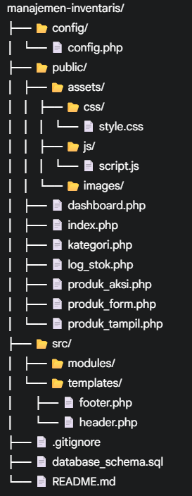

Kelompok 12 |
Kelas 1 TIB |
Project Workshop Basis Data Lanjut |
Anggota Kelompok: 
-Fathur rizky assani
-Robby kurnia |

# Aplikasi Manajemen Inventaris Sederhana

Aplikasi ini adalah sistem manajemen inventaris berbasis web yang dibangun menggunakan PHP dan MySQL. Proyek ini dirancang sebagai aplikasi web dinamis yang memungkinkan pengguna untuk mengelola data produk dan kategori secara efisien. Fokus utama dari proyek ini adalah implementasi operasi CRUD (Create, Read, Update, Delete) yang fundamental, penggunaan objek database tingkat lanjut seperti View, Trigger, dan Function, serta penyajian data agregat untuk analisis bisnis sederhana.

Aplikasi ini memiliki antarmuka yang bersih dan fungsional, memisahkan antara halaman publik (landing page) dan sistem internal (dashboard, manajemen data), serta menerapkan struktur folder yang rapi untuk kemudahan pemeliharaan dan pengembangan lebih lanjut.


*(Ganti placeholder di atas dengan screenshot hasil akhir aplikasi Anda)*

---

## Fitur Utama

Berikut adalah daftar fungsionalitas utama yang dimiliki oleh aplikasi ini:

* ✅ **Dashboard Analitis**: Menampilkan ringkasan data penting secara real-time, termasuk:
    * Total jumlah produk.
    * Total jumlah kategori.
    * Jumlah total stok dari semua produk.
    * Estimasi total nilai aset inventaris (`SUM(harga * stok)`).

* ✅ **Manajemen Produk (Full CRUD)**:
    * **Create**: Menambahkan produk baru melalui form yang terstruktur.
    * **Read**: Menampilkan seluruh produk dalam tabel yang rapi dan mudah dibaca.
    * **Update**: Mengedit informasi produk yang sudah ada.
    * **Delete**: Menghapus produk dari database dengan konfirmasi.

* ✅ **Manajemen Kategori (Full CRUD)**:
    * Menambah, menampilkan, mengedit, dan menghapus kategori produk.
    * Dilengkapi validasi untuk mencegah penghapusan kategori yang masih digunakan oleh produk.

* ✅ **Log Perubahan Stok Otomatis**:
    * Setiap kali stok sebuah produk di-update, sistem secara otomatis mencatat riwayat perubahannya.
    * Halaman "Log Stok" menampilkan jejak audit ini, menunjukkan produk mana yang berubah, jumlah stok lama, jumlah stok baru, dan kapan perubahan terjadi. Fitur ini didukung oleh **Database Trigger**.

* ✅ **Status Stok Dinamis**:
    * Produk secara visual ditandai dengan status "Tersedia", "Stok Menipis", atau "Habis" berdasarkan jumlah stoknya. Logika ini dikelola oleh sebuah **Database Function**.

* ✅ **Landing Page Profesional**: Halaman depan yang statis dan menarik untuk menyambut pengunjung sebelum masuk ke sistem utama.

---

## Teknologi yang Digunakan

Aplikasi ini dibangun dengan menggunakan tumpukan teknologi standar yang populer untuk pengembangan web dinamis:

* **Frontend**:
    * **HTML5**: Untuk struktur konten halaman web.
    * **CSS3**: Untuk styling, layouting, dan membuat antarmuka pengguna menjadi menarik dan responsif.
    * **JavaScript**: Untuk interaktivitas sisi klien, seperti dialog konfirmasi sebelum penghapusan data.

* **Backend**:
    * **PHP (Versi 7.4+)**: Sebagai bahasa pemrograman utama di sisi server untuk menangani semua logika bisnis, pemrosesan form, dan interaksi dengan database.
    * **PDO (PHP Data Objects)**: Ekstensi yang digunakan untuk menyediakan koneksi yang aman dan konsisten ke database, serta melindungi dari serangan SQL Injection melalui *prepared statements*.

* **Database**:
    * **MySQL / MariaDB**: Sebagai sistem manajemen database relasional (RDBMS) untuk menyimpan semua data aplikasi, mulai dari produk, kategori, hingga log perubahan stok.

* **Lingkungan Pengembangan**:
    * **XAMPP / WAMP**: Digunakan sebagai server web lokal (Apache), database server (MySQL), dan interpreter PHP.

---

## Struktur Folder Proyek

Struktur folder proyek ini dirancang dengan mengikuti praktik terbaik pengembangan web, yaitu dengan memisahkan antara file yang dapat diakses publik dan logika inti aplikasi untuk meningkatkan keamanan dan keteraturan kode.
Coding partner

Show thinking
Baik, mari kita lanjutkan.

Bagian 2 dari 6: Teknologi dan Struktur Proyek
Bagian ini menjelaskan "alat-alat" (teknologi) yang kita gunakan untuk membangun aplikasi serta "peta" atau denah dari keseluruhan proyek (struktur folder). Ini penting untuk menunjukkan bahwa proyek dibangun di atas fondasi yang standar dan terorganisir dengan baik.

Instruksi:
Silakan tambahkan (append) teks di bawah ini ke dalam file README.md Anda, tepat di bawah bagian sebelumnya.

Markdown

---

## Teknologi yang Digunakan

Aplikasi ini dibangun dengan menggunakan tumpukan teknologi standar yang populer untuk pengembangan web dinamis:

* **Frontend**:
    * **HTML5**: Untuk struktur konten halaman web.
    * **CSS3**: Untuk styling, layouting, dan membuat antarmuka pengguna menjadi menarik dan responsif.
    * **JavaScript**: Untuk interaktivitas sisi klien, seperti dialog konfirmasi sebelum penghapusan data.

* **Backend**:
    * **PHP (Versi 7.4+)**: Sebagai bahasa pemrograman utama di sisi server untuk menangani semua logika bisnis, pemrosesan form, dan interaksi dengan database.
    * **PDO (PHP Data Objects)**: Ekstensi yang digunakan untuk menyediakan koneksi yang aman dan konsisten ke database, serta melindungi dari serangan SQL Injection melalui *prepared statements*.

* **Database**:
    * **MySQL / MariaDB**: Sebagai sistem manajemen database relasional (RDBMS) untuk menyimpan semua data aplikasi, mulai dari produk, kategori, hingga log perubahan stok.

* **Lingkungan Pengembangan**:
    * **XAMPP / WAMP**: Digunakan sebagai server web lokal (Apache), database server (MySQL), dan interpreter PHP.

---

## Struktur Folder Proyek

Struktur folder proyek ini dirancang dengan mengikuti praktik terbaik pengembangan web, yaitu dengan memisahkan antara file yang dapat diakses publik dan logika inti aplikasi untuk meningkatkan keamanan dan keteraturan kode.

manajemen-inventaris/
├── 📂 config/
│   └── 📄 config.php
├── 📂 public/
│   ├── 📂 assets/
│   │   ├── 📂 css/
│   │   │   └── 📄 style.css
│   │   ├── 📂 js/
│   │   │   └── 📄 script.js
│   │   └── 📂 images/
│   ├── 📄 dashboard.php
│   ├── 📄 index.php
│   ├── 📄 kategori.php
│   ├── 📄 log_stok.php
│   ├── 📄 produk_aksi.php
│   ├── 📄 produk_form.php
│   └── 📄 produk_tampil.php
├── 📂 src/
│   ├── 📂 modules/
│   └── 📂 templates/
│       ├── 📄 footer.php
│       └── 📄 header.php
├── 📄 .gitignore
├── 📄 database_schema.sql
└── 📄 README.md

### Penjelasan Struktur

* **`/config`**: Folder ini berisi file konfigurasi krusial dan sensitif.
    * `config.php`: Menyimpan kredensial koneksi database (host, user, password, nama database). Diletakkan di luar folder publik untuk mencegah akses langsung dari browser, sehingga meningkatkan keamanan.

* **`/public`**: Ini adalah **Document Root** atau folder publik. Hanya file di dalam folder inilah yang seharusnya bisa diakses langsung oleh pengguna melalui browser.
    * `/assets`: Berisi semua aset statis seperti file CSS untuk styling, JavaScript untuk interaktivitas, dan gambar.
    * File `.php` (misal: `dashboard.php`, `produk_tampil.php`): Ini adalah halaman-halaman yang dilihat dan berinteraksi langsung dengan pengguna. File-file ini bertanggung jawab untuk menampilkan data (View) dan menerima input pengguna.
    * `produk_aksi.php`: Contoh file yang berperan sebagai *controller* sederhana, bertugas murni untuk memproses logika (menerima data dari form) tanpa menampilkan HTML.

* **`/src` (Source)**: Berisi kode sumber dan logika inti dari aplikasi yang tidak perlu diakses langsung oleh pengguna.
    * `/templates`: Berisi bagian-bagian HTML yang dapat digunakan kembali (`reusable components`) seperti `header.php` dan `footer.php`. Ini menerapkan prinsip **DRY (Don't Repeat Yourself)**, membuat kode lebih bersih dan mudah dikelola.
    * `/modules`: (Untuk saat ini kosong) Direktori ini disiapkan untuk menampung fungsi-fungsi atau kelas-kelas bisnis yang lebih kompleks di masa depan, misalnya `ProductManager.php` atau `CategoryManager.php`.

* **File di Root**:
    * `database_schema.sql`: Berkas "cetak biru" yang berisi semua perintah SQL untuk membuat ulang struktur database dari awal.
    * `README.md`: File dokumentasi yang sedang Anda baca ini.

---

## Desain dan Skema Database

Database aplikasi ini menggunakan model relasional untuk memastikan integritas dan konsistensi data. Terdiri dari tiga tabel utama yang dirancang untuk menyimpan informasi produk, kategori, dan riwayat perubahan stok.

### Hubungan Antar Tabel (Entity Relationship)

1.  **`kategori` ke `produk` (One-to-Many)**
    * Ini adalah hubungan utama dalam aplikasi. **Satu Kategori** dapat memiliki **banyak Produk**, namun **satu Produk** hanya bisa termasuk dalam **satu Kategori**.
    * Hubungan ini diimplementasikan dengan menggunakan *Foreign Key* `id_kategori` pada tabel `produk` yang merujuk ke *Primary Key* `id_kategori` pada tabel `kategori`.
    * Penggunaan `ON DELETE CASCADE` memastikan bahwa jika sebuah kategori dihapus, semua produk yang terkait dengannya juga akan terhapus secara otomatis (meskipun dalam aplikasi ini kita menambahkan proteksi untuk mencegah hal ini terjadi jika kategori masih digunakan).

2.  **`produk` ke `log_stok` (One-to-Many / Audit Trail)**
    * Tabel `log_stok` berfungsi sebagai jejak audit (audit trail) untuk tabel `produk`.
    * Setiap kali nilai `stok` pada sebuah baris di tabel `produk` diperbarui, sebuah baris baru akan dibuat di tabel `log_stok` yang mencatat perubahan tersebut.
    * Hubungan ini tidak diatur oleh *Foreign Key* secara eksplisit, melainkan dikelola oleh sebuah **Database Trigger**.

### Struktur Tabel Detail

Berikut adalah rincian dari setiap tabel dalam database `inventaris_db`.

#### Tabel: `kategori`
Tabel ini berfungsi sebagai master data untuk semua kategori produk yang tersedia.

| Nama Kolom    | Tipe Data     | Keterangan                                |
|---------------|---------------|-------------------------------------------|
| `id_kategori` | `INT(11)`     | **Primary Key**, Auto Increment.          |
| `nama_kategori` | `VARCHAR(100)`| Nama unik dari kategori (mis: "Elektronik"). |

---

#### Tabel: `produk`
Tabel ini menyimpan semua informasi detail mengenai setiap produk yang dijual atau dikelola.

| Nama Kolom    | Tipe Data       | Keterangan                                                 |
|---------------|-----------------|------------------------------------------------------------|
| `id_produk`   | `INT(11)`       | **Primary Key**, Auto Increment.                           |
| `id_kategori` | `INT(11)`       | **Foreign Key** yang merujuk ke `kategori.id_kategori`.    |
| `nama_produk` | `VARCHAR(150)`  | Nama dari produk.                                          |
| `harga`       | `DECIMAL(10,2)` | Harga produk, mendukung dua angka di belakang koma.        |
| `stok`        | `INT(11)`       | Jumlah stok produk yang tersedia saat ini.                 |

---

#### Tabel: `log_stok`
Tabel ini secara otomatis merekam setiap histori perubahan pada kolom `stok` di tabel `produk`.

| Nama Kolom    | Tipe Data       | Keterangan                                                 |
|---------------|-----------------|------------------------------------------------------------|
| `id_log`      | `INT(11)`       | **Primary Key**, Auto Increment.                           |
| `id_produk`   | `INT(11)`       | ID produk yang stoknya berubah.                            |
| `stok_lama`   | `INT(11)`       | Jumlah stok **sebelum** diperbarui.                        |
| `stok_baru`   | `INT(11)`       | Jumlah stok **setelah** diperbarui.                        |
| `waktu_ubah`  | `TIMESTAMP`     | Waktu pasti kapan perubahan terjadi, default ke waktu saat ini. |

---

Struktur ini dirancang untuk menjadi normal dan efisien, menghindari redundansi data dan memastikan bahwa data dapat dikelola dengan mudah. Untuk perintah SQL lengkap dalam pembuatan skema ini, silakan merujuk ke file `database_schema.sql`.

---

## Analisis Objek Database Tingkat Lanjut

Untuk memenuhi persyaratan proyek dan menerapkan praktik terbaik, aplikasi ini tidak hanya bergantung pada tabel, tetapi juga pada objek database lain yang lebih canggih.

### 1. VIEW: `v_produk_lengkap`

* **Apa itu VIEW?**
    Sebuah `VIEW` adalah tabel virtual yang isinya didefinisikan oleh sebuah query SQL. VIEW tidak menyimpan data secara fisik, melainkan berfungsi sebagai "jendela" atau representasi dari data yang diambil dari satu atau lebih tabel. Ia dapat di-query layaknya sebuah tabel biasa.

* **Implementasi & Manfaat:**
    Dalam proyek ini, `v_produk_lengkap` dibuat untuk menggabungkan (`JOIN`) tabel `produk` dan `kategori`. Tujuannya adalah untuk menampilkan nama kategori di samping setiap produk.

    **Tanpa VIEW**, query di dalam kode PHP akan terlihat seperti ini:
    ```sql
    SELECT p.nama_produk, p.harga, p.stok, k.nama_kategori
    FROM produk p
    JOIN kategori k ON p.id_kategori = k.id_kategori;
    ```
    **Dengan VIEW**, query tersebut menjadi jauh lebih sederhana:
    ```sql
    SELECT * FROM v_produk_lengkap;
    ```

    **Manfaat yang didapat:**
    * **Simplifikasi Kode**: Kode PHP menjadi lebih bersih, singkat, dan lebih mudah dibaca karena tidak perlu lagi menulis query `JOIN` yang kompleks di setiap halaman yang membutuhkan data gabungan.
    * **Enkapsulasi Logika**: Logika untuk menggabungkan data produk dan kategori disimpan di dalam database itu sendiri, bukan tersebar di kode aplikasi. Ini memisahkan antara logika data dan logika presentasi.
    * **Keamanan**: Kita bisa memberikan akses kepada pengguna hanya ke `VIEW` tanpa memberikan akses ke tabel aslinya, sebagai lapisan keamanan tambahan.

### 2. TRIGGER: `trg_catat_perubahan_stok`

* **Apa itu TRIGGER?**
    Sebuah `TRIGGER` adalah blok kode prosedural yang tersimpan di database dan akan dieksekusi secara otomatis ketika terjadi sebuah event spesifik (seperti `INSERT`, `UPDATE`, atau `DELETE`) pada sebuah tabel.

* **Implementasi & Manfaat:**
    Trigger `trg_catat_perubahan_stok` diatur untuk aktif **`AFTER UPDATE`** pada tabel `produk`. Logikanya adalah sebagai berikut:
    1.  Setelah sebuah baris di tabel `produk` di-update...
    2.  Trigger akan memeriksa apakah nilai kolom `stok` yang lama (`OLD.stok`) tidak sama dengan nilai `stok` yang baru (`NEW.stok`).
    3.  Jika berbeda, trigger akan secara otomatis menjalankan perintah `INSERT` untuk menambahkan satu baris data baru ke dalam tabel `log_stok`, mencatat ID produk, stok lama, dan stok baru.

    **Manfaat yang didapat:**
    * **Otomatisasi Penuh**: Proses pencatatan riwayat (audit trail) terjadi secara otomatis di level database. Kode aplikasi PHP tidak perlu menulis logika tambahan apapun untuk mencatat log.
    * **Integritas & Akurasi**: Karena prosesnya otomatis dan terikat langsung pada event database, risiko "lupa" mencatat log oleh aplikasi menjadi nol. Catatan log dijamin akurat sesuai dengan transaksi yang terjadi.
    * **Pemisahan Tanggung Jawab (Separation of Concerns)**: Tugas pencatatan log diserahkan sepenuhnya kepada database, yang memang lebih andal untuk tugas semacam ini. Kode aplikasi tetap fokus pada tugas utamanya, yaitu memperbarui data produk.

### 3. FUNCTION: `fn_status_stok`

* **Apa itu User-Defined FUNCTION?**
    Sebuah `FUNCTION` adalah sebuah rutin yang dapat menerima parameter, menjalankan serangkaian logika, dan mengembalikan sebuah nilai tunggal. Fungsi ini dapat dipanggil langsung di dalam query SQL.

* **Implementasi & Manfaat:**
    Fungsi `fn_status_stok` dirancang untuk menerima satu parameter input, yaitu jumlah stok (`INT`), dan mengembalikan sebuah status dalam bentuk `VARCHAR` (teks). Logikanya menggunakan `IF-ELSEIF-ELSE` untuk mengembalikan:
    * "Tersedia" jika stok > 10.
    * "Stok Menipis" jika stok antara 1 dan 10.
    * "Habis" jika stok adalah 0 atau kurang.

    Fungsi ini dipanggil langsung di dalam query utama pada halaman `produk_tampil.php`:
    ```sql
    SELECT *, fn_status_stok(stok) AS status_stok FROM v_produk_lengkap;
    ```

    **Manfaat yang didapat:**
    * **Logika yang Dapat Digunakan Kembali (Reusable)**: Logika untuk menentukan status stok didefinisikan satu kali di dalam database dan dapat digunakan di query mana pun tanpa perlu menulis ulang.
    * **Menyederhanakan Kode Aplikasi**: Tanpa fungsi ini, kode PHP harus mengambil angka stok, lalu menggunakan `if-else` di dalam perulangan `foreach` untuk menentukan dan menampilkan status. Dengan fungsi ini, PHP hanya perlu menampilkan hasil teks yang sudah jadi, membuat kode di bagian *view* menjadi jauh lebih bersih.
    * **Konsistensi**: Aturan bisnis untuk status stok terpusat di satu tempat, memastikan bahwa aturan yang sama diterapkan secara konsisten di seluruh bagian aplikasi.

---

## Alur Kerja Aplikasi dan Logika Kode

Untuk memahami bagaimana aplikasi ini berfungsi secara dinamis, mari kita telusuri siklus hidup dari sebuah permintaan pengguna (user request) pada salah satu fitur inti: **Mengedit Data Produk**.

Alur ini menunjukkan interaksi antara antarmuka (frontend), logika server (backend), dan database.

### Analisis Alur: Mengedit Data Produk

Alur ini dimulai dari halaman daftar produk dan berakhir saat pengguna melihat data yang telah diperbarui.

**1. Tahap Inisiasi (Halaman Daftar Produk)**
* **File Terlibat**: `public/produk_tampil.php`
* **Aksi Pengguna**: Pengguna melihat tabel berisi daftar produk dan mengklik tombol kuning **"Edit"** pada salah satu baris produk.
* **Aksi Kode**: Tombol "Edit" tersebut adalah sebuah link HTML (`<a>`) yang `href`-nya telah dibuat secara dinamis untuk mengarah ke `produk_form.php` sambil menyertakan ID produk sebagai parameter di URL. Contoh: `produk_form.php?id=2`.

**2. Tahap Penyiapan Form (Menampilkan Data Lama)**
* **File Terlibat**: `public/produk_form.php`
* **Aksi Kode**: Server mengeksekusi file `produk_form.php`.
    * Logika PHP di bagian atas file ini pertama kali memeriksa keberadaan `$_GET['id']`. Karena ID ada di URL, skrip menyimpulkan bahwa ini adalah **mode edit**.
    * Skrip kemudian menjalankan query `SELECT` ke database menggunakan *prepared statement* untuk mengambil semua detail produk yang memiliki ID tersebut. Ini penting untuk keamanan.
    * Data yang berhasil diambil dari database (nama produk, harga, stok, id_kategori) disimpan ke dalam variabel-variabel PHP.
    * Variabel-variabel ini kemudian di-`echo` ke dalam atribut `value` dari setiap elemen form (`<input>`, `<select>`). Untuk dropdown kategori, logika PHP akan menambahkan atribut `selected` pada `<option>` yang sesuai dengan data produk.
    * Halaman HTML yang berisi form yang sudah terisi data ini kemudian dikirim ke browser pengguna.

**3. Tahap Pengiriman Data (Input dari Pengguna)**
* **File Terlibat**: `public/produk_form.php` (di browser pengguna)
* **Aksi Pengguna**: Pengguna mengubah satu atau lebih data pada form (misalnya, mengubah harga atau stok) lalu mengklik tombol **"Simpan Perubahan"**.
* **Aksi Kode**: Aksi ini memicu event `submit` pada form. Browser akan mengemas semua data dari form (termasuk data dari `input` tersembunyi seperti `id_produk` dan `action='edit'`) dan mengirimkannya ke `produk_aksi.php` menggunakan metode `POST`.

**4. Tahap Pemrosesan di Backend**
* **File Terlibat**: `public/produk_aksi.php`
* **Aksi Kode**: File `produk_aksi.php` dieksekusi di server. File ini tidak menghasilkan tampilan HTML.
    * Skrip memeriksa bahwa permintaan datang melalui metode `POST`.
    * Ia membaca `$_POST['action']` yang bernilai `'edit'`, sehingga blok logika untuk *update* yang akan dijalankan.
    * Semua data yang relevan diambil dari `$_POST`.
    * Skrip menjalankan query `UPDATE` ke database, lagi-lagi menggunakan *prepared statement* untuk memasukkan data baru dengan aman ke dalam query, berdasarkan `id_produk` yang dituju.
    * **Saat inilah `TRIGGER` database aktif!** Jika nilai `stok` berubah, `trg_catat_perubahan_stok` secara otomatis memasukkan catatan ke tabel `log_stok`.
    * Setelah query `UPDATE` berhasil dieksekusi, skrip menyimpan sebuah pesan konfirmasi ke dalam `$_SESSION['pesan']` (contoh: "Data produk berhasil diperbarui.").

**5. Tahap Pengalihan dan Umpan Balik**
* **File Terlibat**: `public/produk_aksi.php` dan `public/produk_tampil.php`
* **Aksi Kode**:
    * Setelah pemrosesan selesai, `produk_aksi.php` menjalankan fungsi `header('Location: produk_tampil.php')`. Ini adalah perintah kepada browser untuk secara otomatis mengalihkan pengguna kembali ke halaman daftar produk.
    * Halaman `produk_tampil.php` dieksekusi untuk kedua kalinya.
    * Kali ini, skrip di bagian atasnya akan mendeteksi adanya `$_SESSION['pesan']`. Pesan ini kemudian ditampilkan sebagai notifikasi berwarna hijau di bagian atas halaman. Pesan tersebut kemudian dihapus dari session (`unset`) agar tidak tampil lagi saat halaman di-refresh.
    * Query `SELECT * FROM v_produk_lengkap` dijalankan ulang, yang kini mengambil data terbaru dari database.
    * Pengguna melihat tabel daftar produk dengan data yang sudah berhasil diperbarui, beserta pesan konfirmasi. Siklus selesai.

---
Alur kerja untuk **Menambah Produk** sangat mirip, perbedaannya hanya pada Tahap 2 (form ditampilkan dalam keadaan kosong) dan Tahap 4 (query yang dijalankan adalah `INSERT`). Alur **Menghapus Produk** lebih sederhana, yaitu sebuah link (`GET`) langsung memicu query `DELETE` di `produk_aksi.php` sebelum diarahkan kembali.

---

## Instalasi dan Konfigurasi

Untuk menjalankan aplikasi ini di lingkungan lokal, ikuti langkah-langkah berikut:

### Prasyarat

* Server lokal seperti **XAMPP** atau **WAMP** yang sudah terinstal (sudah termasuk Apache, PHP, MySQL/MariaDB).
* Web browser (misalnya: Google Chrome, Firefox).
* Code editor (misalnya: Visual Studio Code).

### Langkah-langkah Instalasi

1.  **Clone Repository**:
    Clone repository ini ke mesin lokal Anda atau unduh dalam format ZIP dan ekstrak.
    ```bash
    # Jika menggunakan git
    git clone [URL_REPOSITORY_ANDA]
    ```

2.  **Pindahkan Folder Proyek**:
    Letakkan folder proyek `manajemen-inventaris` ke dalam direktori `htdocs` di dalam folder instalasi XAMPP Anda (biasanya di `C:/xampp/htdocs/`).

3.  **Jalankan Server Lokal**:
    Buka XAMPP Control Panel dan klik tombol **"Start"** untuk modul **Apache** dan **MySQL**.

4.  **Buat Database**:
    * Buka browser dan akses `http://localhost/phpmyadmin`.
    * Buat sebuah database baru dengan nama `inventaris_db`.

5.  **Impor Skema Database**:
    * Setelah membuat database, pilih database `inventaris_db` tersebut dari daftar di sebelah kiri.
    * Klik pada tab **"Import"**.
    * Klik tombol "Choose File" dan pilih file `database_schema.sql` yang ada di dalam folder utama proyek.
    * Scroll ke bawah dan klik tombol "Go" atau "Import" untuk memulai proses. Semua tabel, view, trigger, dan function akan otomatis dibuat.

6.  **Konfigurasi Koneksi (Opsional)**:
    * Secara default, aplikasi dikonfigurasi untuk terhubung ke database dengan username `root` dan tanpa password.
    * Jika konfigurasi MySQL Anda berbeda, buka file `config/config.php` dan sesuaikan nilai `DB_USER` dan `DB_PASS`.

7.  **Jalankan Aplikasi**:
    Buka kembali browser Anda dan akses aplikasi melalui URL:
    **`http://localhost/manajemen-inventaris/public/`**

Aplikasi sekarang seharusnya sudah berjalan dengan baik.

---

## Kesimpulan

Proyek Aplikasi Manajemen Inventaris ini telah berhasil dikembangkan sesuai dengan seluruh spesifikasi dan persyaratan awal. Aplikasi ini secara efektif mendemonstrasikan pemahaman dan implementasi konsep-konsep inti dalam pengembangan web dinamis, termasuk:
* Struktur database relasional yang ternormalisasi.
* Fungsionalitas **CRUD (Create, Read, Update, Delete)** yang lengkap dan aman.
* Pemanfaatan objek database canggih (**VIEW, TRIGGER, FUNCTION**) untuk otomasi dan efisiensi.
* Struktur kode yang terorganisir dengan baik, memisahkan antara konfigurasi, logika, dan tampilan.

Proyek ini tidak hanya berfungsi sebagai sebuah aplikasi yang utuh, tetapi juga sebagai portofolio solid yang menunjukkan kemampuan dalam merancang dan membangun sistem dari awal hingga akhir.

---

## Potensi Pengembangan

Aplikasi ini memiliki fondasi yang kuat dan dapat dikembangkan lebih lanjut dengan menambahkan fitur-fitur berikut:

* **Sistem Otentikasi Pengguna**: Menambahkan fitur login dan register sehingga hanya pengguna terotorisasi yang dapat mengakses dan mengelola data.
* **Fitur Pencarian dan Filter**: Menambahkan fungsionalitas pencarian untuk memudahkan pengguna menemukan produk tertentu dengan cepat.
* **Paginasi (Halaman)**: Menerapkan sistem halaman pada tabel daftar produk untuk menangani data dalam jumlah besar secara efisien.
* **Laporan Visual dengan Grafik**: Menggunakan library JavaScript seperti `Chart.js` untuk memvisualisasikan data pada dashboard.
* **Validasi Form Lanjutan**: Menambahkan validasi yang lebih kuat di sisi server (misalnya, memastikan nama produk tidak duplikat) dan sisi klien (feedback instan tanpa refresh).
<!--  -->
<!--  -->
<!--  -->
### **Riwayat** ### :
Baik, tentu saja. Mari kita coba ide ketiga yang berfokus pada inventaris dan penjualan, yang merupakan dasar dari banyak aplikasi bisnis.

Ide ketiga ini adalah **Aplikasi Manajemen Inventaris Toko Sederhana**.

Ini adalah pilihan yang sangat kuat karena operasi seperti mengelola stok, harga, dan kategori adalah contoh klasik dan sangat nyata dari penggunaan database relasional dalam dunia kerja.

### **Gambaran Umum Proyek: Aplikasi Manajemen Inventaris Toko**

Bayangkan sebuah aplikasi untuk pemilik toko kecil (misalnya toko buku, toko baju, atau warung) untuk mencatat semua produk yang mereka jual. Mereka bisa menambah produk baru, mengelompokkannya ke dalam kategori, dan memperbarui jumlah stok dan harga.

---

### **Bagaimana Proyek Ini Memenuhi Semua Syarat Anda**

Berikut adalah rincian bagaimana proyek inventaris ini dapat diimplementasikan sesuai syarat Anda.

#### **1. Minimal 2 Tabel Berelasi**

Struktur datanya akan sangat mirip dengan katalog, namun dengan penekanan pada stok dan harga.

* **Tabel `kategori`**: Mengelompokkan jenis produk.
    * `id_kategori` (Primary Key)
    * `nama_kategori` (Contoh: 'Buku Fiksi', 'Buku Pelajaran', 'Alat Tulis')

* **Tabel `produk`**: Menyimpan detail setiap barang yang dijual.
    * `id_produk` (Primary Key)
    * `id_kategori` (Foreign Key ke `kategori.id_kategori`)
    * `nama_produk` (Contoh: 'Buku Pemrograman PHP', 'Pensil 2B')
    * `harga` (Tipe data DECIMAL atau INT)
    * `stok` (Jumlah barang yang tersedia)

**Relasi**: Satu `kategori` bisa menaungi banyak `produk`. Ini adalah relasi *one-to-many* yang memenuhi syarat.

#### **2. Minimal 3 Objek Database**

Untuk ide ini, mari kita gunakan **VIEW**, **TRIGGER**, dan sebuah **FUNCTION** untuk menunjukkan kapabilitas database yang berbeda lagi.

* **Fitur Website dari Objek Database:**
    1.  **`VIEW`**: Kita akan membuat `VIEW` bernama `v_produk_lengkap`.
        * **Implementasi di Website**: Halaman utama "Daftar Produk" akan menampilkan data dari `VIEW` ini. Ini sangat berguna karena kita bisa menampilkan nama produk beserta nama kategorinya tanpa perlu menulis query `JOIN` yang kompleks di kode PHP setiap saat.
        * **Contoh Kode SQL**:
            ```sql
            CREATE VIEW v_produk_lengkap AS
            SELECT
                p.id_produk,
                p.nama_produk,
                p.harga,
                p.stok,
                k.nama_kategori
            FROM produk p
            JOIN kategori k ON p.id_kategori = k.id_kategori;
            ```

    2.  **`TRIGGER`**: Kita akan membuat `TRIGGER` untuk mencatat riwayat perubahan stok. Ini adalah fitur audit yang sangat berguna. Pertama kita buat tabel `log_stok`, lalu `TRIGGER` akan mengisi tabel ini secara otomatis.
        * **Implementasi di Website**: Akan ada halaman "Riwayat Stok" di mana admin bisa melihat semua perubahan jumlah stok suatu barang (misal: "Stok Buku X berubah dari 10 menjadi 8 pada tanggal Y"). Ini terjadi secara otomatis setiap kali admin meng-update jumlah stok di form edit produk.
        * **Contoh Kode SQL**:
            ```sql
            -- Pertama, buat tabel log
            CREATE TABLE log_stok (
                id_log INT AUTO_INCREMENT PRIMARY KEY,
                id_produk INT,
                stok_lama INT,
                stok_baru INT,
                waktu_ubah TIMESTAMP DEFAULT CURRENT_TIMESTAMP
            );

            -- Lalu, buat trigger-nya
            DELIMITER $$
            CREATE TRIGGER trg_catat_perubahan_stok
            AFTER UPDATE ON produk
            FOR EACH ROW
            BEGIN
                IF OLD.stok <> NEW.stok THEN
                    INSERT INTO log_stok(id_produk, stok_lama, stok_baru)
                    VALUES(OLD.id_produk, OLD.stok, NEW.stok);
                END IF;
            END$$
            DELIMITER ;
            ```

    3.  **`FUNCTION`**: Kita akan membuat `FUNCTION` bernama `fn_status_stok` yang menerima angka stok dan mengembalikan statusnya dalam bentuk teks.
        * **Implementasi di Website**: Di halaman daftar produk, di samping jumlah stok, kita bisa menampilkan label warna-warni (misal: Hijau, Kuning, Merah) berdasarkan statusnya. Logika ini kita serahkan ke database. Kode PHP tinggal memanggil fungsi ini dalam query `SELECT`.
        * **Contoh Kode SQL**:
            ```sql
            DELIMITER $$
            CREATE FUNCTION fn_status_stok(jumlah_stok INT)
            RETURNS VARCHAR(20)
            DETERMINISTIC
            BEGIN
                DECLARE status_text VARCHAR(20);
                IF jumlah_stok > 10 THEN
                    SET status_text = 'Tersedia';
                ELSEIF jumlah_stok > 0 AND jumlah_stok <= 10 THEN
                    SET status_text = 'Stok Menipis';
                ELSE
                    SET status_text = 'Habis';
                END IF;
                RETURN status_text;
            END$$
            DELIMITER ;
            ```
            -- Cara panggil di PHP: SELECT nama_produk, stok, fn_status_stok(stok) as status FROM produk;

#### **3. Harus Ada DML (Antarmuka CRUD)**

Aplikasi ini sepenuhnya didasarkan pada CRUD untuk mengelola data inventaris.

* **Fitur Website dari CRUD:**
    * **Create**: Form untuk "Tambah Produk Baru" dan "Tambah Kategori Baru".
    * **Read**: Halaman utama yang menampilkan "Daftar Semua Produk" dalam tabel. Halaman "Daftar Kategori".
    * **Update**: Form "Edit Produk" untuk mengubah nama, harga, atau jumlah stok.
    * **Delete**: Tombol "Hapus" untuk menghapus produk atau kategori dari daftar.

#### **4. Harus Ada Operasi Agregat (SUM, MIN, MAX)**

Operasi agregat akan menjadi inti dari halaman Dashboard/Laporan.

* **Fitur Website dari Operasi Agregat:**
    * **`SUM()`**: Menampilkan "Total Aset Inventaris" dengan menghitung `SUM(harga * stok)`. Ini adalah metrik bisnis yang sangat nyata.
    * **`COUNT()`**: Menampilkan "Jumlah Total Produk" dan "Jumlah Produk per Kategori".
    * **`AVG()`**: Menampilkan "Harga Rata-Rata Produk".
    * **`MAX()` & `MIN()`**: Menampilkan "Produk Termahal" dan "Produk Termurah".

---

### **Ringkasan Perbandingan Ketiga Ide**

Untuk membantu Anda memilih, berikut adalah perbandingan singkat dari ketiga ide yang telah kita diskusikan:

| Aspek | **1. Pencatat Keuangan** | **2. Manajemen Tugas** | **3. Manajemen Inventaris** |
| :--- | :--- | :--- | :--- |
| **Fokus Utama** | Pelacakan data numerik (uang). | Pelacakan alur kerja dan status. | Pengelolaan data produk (stok, harga). |
| **Contoh Agregat Kunci** | `SUM()` untuk total pemasukan/pengeluaran. | `COUNT()` untuk jumlah tugas selesai/belum. | `SUM(harga * stok)` untuk total nilai aset. |
| **Contoh Logic DB Kunci**| `TRIGGER` untuk validasi data (mencegah angka negatif). | `STORED PROCEDURE` untuk mengubah status proyek & semua tugasnya sekaligus. | `TRIGGER` untuk audit log dan `FUNCTION` untuk menentukan status. |
| **Cocok Untuk...** | Menunjukkan kemampuan dalam pelaporan data dan agregasi finansial. | Menunjukkan kemampuan dalam mengelola logika alur kerja dan relasi data yang dinamis. | Menunjukkan kemampuan dalam membuat aplikasi mirip e-commerce dengan logika bisnis (audit, status). |

Dari ketiga ide ini—keuangan pribadi, manajemen tugas, dan manajemen inventaris—mana yang paling sesuai dengan minat dan tujuan proyek Anda?
